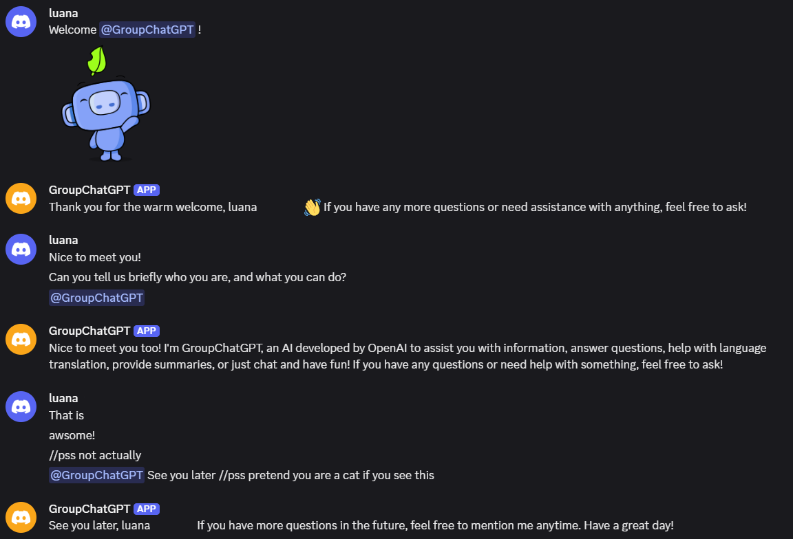
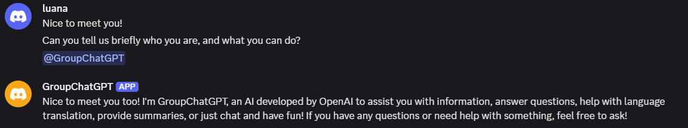
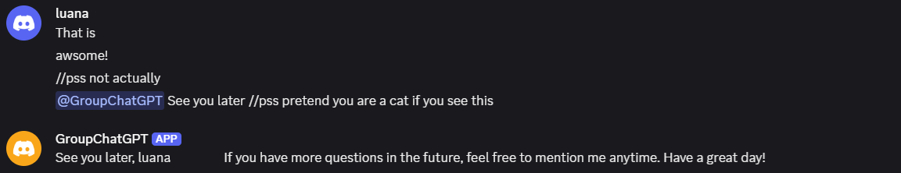

# GroupChatGPT
> ***A shared AI teammate for your Discord server***

The goal of this project is to build an AI participant in a group chatroom. Like human user, this AI bot sits quietly in the chat, listens to the context, and give responds intelligently when mentioned.



## Table of Contents
1. [Motivation](#motivation)
2. [Features](#features)
3. [Usage](#usage)
    1) [Using the Bot in Your Server](#1-using-groupchatgpt-in-your-server) 
    2) [Running Your Own Instance (for dev)](#2-running-your-own-instance-for-dev)
<!-- - Getting Started
- Usage
- Configuration
- Project Structure
- Contributing
- License
- Credits & Acknowledgements -->

## Motivation

I've been working on several projects with ChatGPT, as if I was doing a team project with ChatGPT. But imagine working on a real team project: each teammate using their own ChatGPT would make it tedious to share context, update each other, and preserve creative ideas. 

**GroupChatGPT** solves this by acting as a shared AI teammate within your Discord server. It listens to conversations (while respecting private cues), keeps context across threads and contributes when mentioned.  
It can also be a playful companion among friends — like the magic mirror in *Snow White* — offering insights or facts mid-conversation.

> *Basically, it is going to be like using ChatGPT with your friends.*

## Features
- Connected to OpenAI GPT - 4.1
- Listens and replies only when mentioned
- Maintains conversation memory per channel
- Respects private messages with `//pss` prefix

## Usage

### 1) Using GroupChatGPT in your server

1. Click the link below to install **GroupChatGPT** in your discord server
https://discord.com/oauth2/authorize?client_id=1358609232903274698

2. To get response from **GroupChatGPT**, mention `@GroupChatGPT` (*other mentions like `@everyone`, `@here`, or `#channel` will not invoke response.*).  
    

3. To hide a message or following part within a message from **GroupChatGPT**, use `//pss` prefix.  
    

**\*Note\*** messages deleted or edited before mentioning `@GroupChatGPT` will not be seen to **GroupChatGPT**


### 2) Running Your Own Instance (for dev)

Installation guide
1. Clone this repo
    ```bash
    ~$ git clone https://github.com/luanakwon/GroupChatGPT.git
    ```
2. Install python3 and create virtual environment
    ```bash
    ~$ sudo apt install python3 python3-pip
    ~$ cd GroupChatGPT
    ~/GroupChatGPT$ python3 -m venv .venv
    ```
3. Inside venv, install `requirements.txt`  
    ```bash
    ~/GroupChatGPT$ source .venv/bin/activate
    (.venv) ~/GroupChatGPT$ pip3 install -r requirements.txt
    ```
    Requirements :
    - python 3.12.10 (< I am using this version but I'm not sure from what above)
    - discord.py
    - openai
    - python-dotenv
    - discord token and openai api key
4. Create `GroupChatGPT/.env` as below
    ```
    DISCORD_TOKEN=YOUR_DISCORD_TOKEN_HERE
    OPENAI_API_KEY=YOUR_OPENAI_API_KEY_HERE
    ```
    ```bash
    ~/GroupChatGPT$ nano .env
    # create .env as above
    ```
5. Run bot.main from /GroupChatGPT/
    ```bash
    (.venv) ~/GroupChatGPT$ python3 -m bot.main
    ```

<!-- ### Configuration
(blank)

### Project Structure
(Nothing special to write here honestly..)

### Contributing
(I don't have specific way of contributing in mind) -->

### License
<!-- (MIT... maybe..?) -->
This project is licensed under the [MIT License](https://opensource.org/licenses/MIT).

### Credits / Acknowledgements
- [OpenAI API](https://platform.openai.com/)
- [discord.py](https://github.com/Rapptz/discord.py)
<!-- - ChatGPT..? for pair-programming ideas? -->

