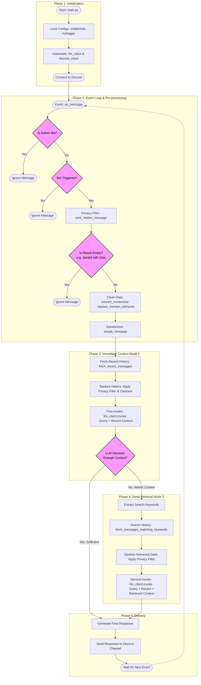

# Repository Details

## Structure
```text
GroupChatGPT/
├── images/                    # Documentation assets
├── bots/                      # Source Code Root
│   ├── main.py                # Entry point; initializes Discord & LLM clients
│   ├── configs/             
│   │   ├── credentials.py     # API key loading & secret management
│   │   └── mylogger.py        # Global logging configuration
│   ├── discord/
│   │   ├── discord_client.py  # Main event loop (on_message, history fetching)
│   │   └── simple_message.py  # Data Class: Standardizes Discord data for LLM
│   └── llm/
│       ├── llm_client.py      # OpenAI wrapper; handles Mode 1 & Mode 2 logic
│       └── prompt.py          # System instructions & persona definitions
├── README.md                  # Project overview & setup
└── privacy.md                 # Privacy policy/data handling details
```

## Flowchart



### Example Context for Coding Agent

If you are pasting this into a new chat or a system prompt to "prime" an AI, you can use this concise block:

> "This repo is a Python Discord bot. `main.py` starts the service. `discord_client.py` handles events and uses `omit_hidden_message` to ignore `//pss` prefixes. Context is gathered via `fetch_recent_messages` or keyword-based retrieval. All LLM calls go through `llm_client.py:invoke()`, which abstracts the OpenAI API. Configs and logs are handled in the `bots/configs/` directory."
